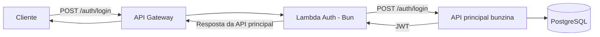

# bunzina-lambda

AWS Lambda de autenticação do Bunzina, executada com Bun em container image e exposta por API Gateway em `POST /auth/login`.

## Tecnologias utilizadas

- Bun
- TypeScript
- AWS Lambda
- API Gateway HTTP API
- Docker
- Amazon ECR
- Serverless Framework
- GitHub Actions
- Axios
- Zod

## Como funciona

A Lambda valida o payload de login e delega a autenticação para a API principal:

```text
API Gateway -> Lambda Bun -> POST /auth/login no bunzina
```

Ela não acessa banco nem gera JWT. O token retornado é o mesmo emitido pelo
`bunzina`.

## Arquitetura

Este repositório representa a Function Serverless de autenticação da aplicação
Bunzina.

O API Gateway expõe apenas a rota `POST /auth/login`, conforme escopo confirmado
para esta etapa. Essa rota encaminha a requisição para a Lambda, que valida o
payload recebido e delega a autenticação para a API principal `bunzina`.

A Lambda não acessa diretamente o banco de dados e não gera JWT. A
responsabilidade de validar credenciais, consultar usuários e gerar o token
continua na aplicação principal.



## Documentação complementar

Os diagramas de arquitetura e sequência da solução ficam centralizados no
repositório principal `bunzina`, dentro da pasta `docs`.

## Endpoint

O endpoint é gerado pelo API Gateway durante o deploy e pode mudar quando a
stack for removida/recriada ou quando o AWS Academy Learner Lab limpar recursos.

Para consultar o endpoint atual:

```bash
bunx serverless info --region us-east-1
```

Ou via AWS CLI:

```bash
API_ID=$(aws cloudformation list-stack-resources \
  --stack-name bunzina-lambda \
  --region us-east-1 \
  --query "StackResourceSummaries[?ResourceType=='AWS::ApiGatewayV2::Api'].PhysicalResourceId | [0]" \
  --output text)

API_URL=$(aws apigatewayv2 get-api \
  --api-id "$API_ID" \
  --region us-east-1 \
  --query "ApiEndpoint" \
  --output text)

echo "$API_URL/auth/login"
```

Exemplo de payload:

```json
{
  "document": "11144477735",
  "password": "senha123"
}
```

## Swagger/Postman

Este repositório não possui Swagger próprio, pois a Lambda não executa um
servidor HTTP diretamente. A rota pública é exposta pelo API Gateway em
`POST /auth/login`.

A documentação Swagger da API principal `bunzina` fica disponível ao executar o
projeto principal localmente:

```text
http://localhost:<porta>/swagger
```

O contrato exposto por esta Lambda é:

```http
POST /auth/login
Content-Type: application/json
```

```json
{
  "document": "11144477735",
  "password": "senha123"
}
```

## Variáveis de ambiente

Variáveis usadas pela Lambda em runtime:

```bash
BUNZINA_API_BASE_URL=https://api.bunzina.example.com
BUNZINA_API_TIMEOUT_MS=5000
```

`BUNZINA_API_BASE_URL` deve apontar para a URL real da API principal `bunzina`. A URL acima e apenas um placeholder.

## AWS Academy Learner Lab

O deploy foi preparado para o AWS Academy Learner Lab usando a role existente:

```text
arn:aws:iam::<AWS_ACCOUNT_ID>:role/LabRole
```

As credenciais do Learner Lab são temporárias. Sempre que o lab reiniciar,
atualize os secrets `AWS_ACCESS_KEY_ID`, `AWS_SECRET_ACCESS_KEY` e
`AWS_SESSION_TOKEN` no GitHub antes de rodar o workflow de deploy.

## Desenvolvimento

```bash
bun install
bun test
bunx tsc --noEmit
```

Para testar o fluxo localmente com Docker, mantenha a API principal `bunzina`
rodando e aponte `BUNZINA_API_BASE_URL` para ela.

Exemplo considerando o `bunzina` em `http://localhost:8081`:

```bash
bun run image:build

docker run --rm -p 9000:8080 \
  -e BUNZINA_API_BASE_URL="http://host.docker.internal:8081" \
  -e BUNZINA_API_TIMEOUT_MS="5000" \
  bunzina-lambda:lambda
```

Em outro terminal:

```bash
curl -i -X POST "http://localhost:9000/2015-03-31/functions/function/invocations" \
  -H "Content-Type: application/json" \
  -d '{"body":"{\"document\":\"11144477735\",\"password\":\"senha123\"}","headers":{"content-type":"application/json"},"requestContext":{"http":{"method":"POST","path":"/auth/login"}}}'
```

## Deploy via GitHub Actions

O deploy principal deve ser feito pelo workflow `.github/workflows/deploy.yml`.
Ele executa testes, builda a imagem Docker, faz push para o ECR e roda o
Serverless Framework apontando a Lambda para a imagem publicada.

Cadastre os seguintes secrets no repositório:

```text
AWS_ACCESS_KEY_ID
AWS_SECRET_ACCESS_KEY
AWS_SESSION_TOKEN
AWS_ACCOUNT_ID
ECR_REPOSITORY
BUNZINA_API_BASE_URL
```

O workflow monta automaticamente:

```text
ECR_IMAGE_URI=$AWS_ACCOUNT_ID.dkr.ecr.us-east-1.amazonaws.com/$ECR_REPOSITORY:latest
```

## Deploy manual

O deploy manual não é o fluxo principal. Use apenas para teste ou troubleshooting.
A imagem precisa ser enviada manualmente para o ECR com `--provenance=false`,
porque a AWS Lambda rejeita alguns manifests OCI gerados pelo build automático
do Serverless/Docker.

```bash
export AWS_DEFAULT_REGION="us-east-1"
export AWS_ACCOUNT_ID="<aws-account-id-do-learner-lab>"
export ECR_REPOSITORY="<nome-do-repositorio-ecr>"
export ECR_IMAGE_URI="$AWS_ACCOUNT_ID.dkr.ecr.$AWS_DEFAULT_REGION.amazonaws.com/$ECR_REPOSITORY:latest"
export BUNZINA_API_BASE_URL="https://api.bunzina.example.com"

aws ecr create-repository --repository-name "$ECR_REPOSITORY" --region "$AWS_DEFAULT_REGION"

aws ecr get-login-password --region "$AWS_DEFAULT_REGION" \
  | docker login --username AWS --password-stdin "$AWS_ACCOUNT_ID.dkr.ecr.$AWS_DEFAULT_REGION.amazonaws.com"

bun run image:build

docker tag bunzina-lambda:lambda "$ECR_IMAGE_URI"
docker push "$ECR_IMAGE_URI"

bun run deploy -- --region "$AWS_DEFAULT_REGION"
```

Se o repositório ECR já existir, o comando `create-repository` pode retornar erro
de duplicidade e pode ser ignorado.

Para remover a stack manualmente:

```bash
export AWS_DEFAULT_REGION="us-east-1"
export AWS_ACCOUNT_ID="<aws-account-id-do-learner-lab>"
export ECR_REPOSITORY="<nome-do-repositorio-ecr>"
export ECR_IMAGE_URI="$AWS_ACCOUNT_ID.dkr.ecr.$AWS_DEFAULT_REGION.amazonaws.com/$ECR_REPOSITORY:latest"

bunx serverless remove --region "$AWS_DEFAULT_REGION"
```

## Teste rápido

Use a URL limpa retornada pelo API Gateway, sem colchetes ou parênteses de Markdown:

```bash
curl -i -X POST "$API_URL/auth/login" \
  -H "Content-Type: application/json" \
  -d '{"document":"invalid","password":""}'
```

Resposta esperada:

```json
{
  "reason": "Invalid data in request",
  "invalidParams": []
}
```
